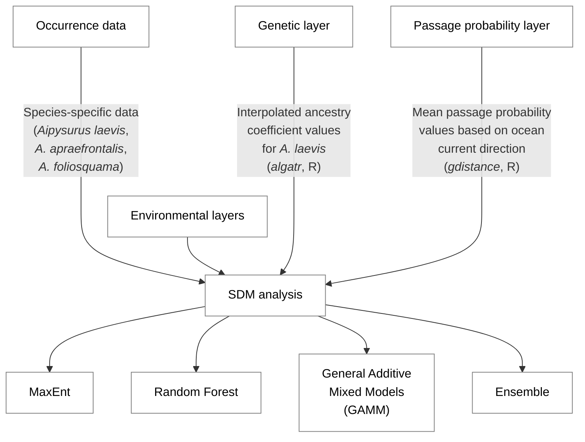

## Tracking Species Trajectories: Determining baseline populations and monitoring methods for Critically Endangered sea snake species

This repository contains input data and code used for developing species distribution models (SDM) for the project: <i><b>Tracking species trajectories</i></b>.

Overall, this project aims to 1) determine baseline populations and develop monitoring methods through mark-recapture methods; and 2) generate more robust species distribution models for two Critically Endangered sea snakes (EPCB Act 1999): the Short-nosed sea snake (<i>Aipysurus apraefrontalis</i>) and the Leaf-scaled sea snake (<i>A. foliosquama</i>)

We look to incorporate genetic information in generating species distribution models. Doing so may progress our understanding of current species-specific distributional ranges as well as identify potential key locations for future surveys.

Our SDM approach is summarised in the diagram below:

##
This project is funded by the Australian Government’s Saving Native Species Program and delivered by the University of Adelaide.